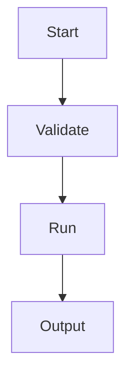

# Docusaurus Markdown Features Standard

## Purpose

This is the single canonical page for how we use Docusaurus Markdown and MDX features.

## Principles alignment

- Skimmable: choose features that improve scanability and comprehension.
- Consistent: use stable patterns for tabs, code blocks, admonitions, and links.
- Beautiful: visual enhancements should support clarity and intent.
- Addressable: heading and link practices should preserve stable deep links.

See [principles.md](./principles.md) for the full principle taxonomy.

It covers all required feature areas:

1. React and MDX
2. Tabs
3. Code blocks
4. Admonitions
5. TOC and headings
6. Assets
7. Links
8. Diagrams (Mermaid)
9. Head metadata

## Adoption matrix

| Feature | Use when | Avoid when | Required default |
|---|---|---|---|
| React and MDX | You need reusable UI blocks or dynamic rendering in docs. | You only need plain Markdown and static text. | Prefer reusable components in `src/components` over complex page-local JSX. |
| Tabs | You have platform/package-manager variants. | You have one linear instruction path. | Use stable `groupId` for synchronized variants (for example `os`, `pkg-manager`). |
| Code blocks | You provide commands, config, API payloads, or source snippets. | You are describing non-executable concepts. | Include language, prefer titled blocks for long snippets, and use comment-based line highlights. |
| Admonitions | You need callouts for risk, prerequisites, tips, or context. | You want to style ordinary body text. | Keep spacing Prettier-safe and map type to intent (`note`, `tip`, `info`, `warning`, `danger`). |
| TOC and headings | You need predictable scan and anchors. | You are writing tiny pages that do not need deep structure. | Use explicit heading IDs for stable deep links where needed. |
| Assets | You need images/files close to docs or themed images. | You can explain clearly with text only. | Prefer co-located assets and themed images for light/dark only when necessary. |
| Links | You reference pages within same docs plugin instance. | You are linking across plugin boundaries. | Prefer relative file-path links to `.md`/`.mdx` for portability and versioning safety. |
| Diagrams | You explain flow/state/interactions better visually. | Diagram would be larger than the explanation itself. | Enable Mermaid globally and keep diagrams small and labeled literally. |
| Head metadata | You need per-page metadata overrides beyond front matter. | Regular SEO and description use cases. | Prefer front matter (`description`, `keywords`, `image`) first; use `<head>` only for exceptions. |

## 1) React and MDX

### Use

- Import reusable components with `@site` alias.
- Keep page MDX simple and push logic to reusable components.

### Guardrails

- MDX is strict: escape special characters like `\{` and `\<` where needed.
- Keep empty lines around Markdown blocks embedded near JSX for parser clarity.
- Use uppercase component tags for mapped MDX components.
- In headings and prose, angle-bracket CLI placeholders (for example `<slug>`) can be parsed as JSX tags; wrap them in code formatting or escape brackets to prevent build errors.

### Example

```mdx
import TOCInline from '@theme/TOCInline';
import Highlight from '@site/src/components/Highlight';

<Highlight color="#1f6feb">Important</Highlight>
<TOCInline toc={toc} />
```

## 2) Tabs

### Use

- OS splits (macOS, Linux, Windows).
- Package manager splits (npm, pnpm, yarn, bun).

### Guardrails

- Use consistent `groupId` names across docs.
- Set explicit `defaultValue` for predictable first render.
- Use `queryString` only when sharable state in URL is valuable.

### Example

```mdx
import Tabs from '@theme/Tabs';
import TabItem from '@theme/TabItem';

<Tabs groupId="os" defaultValue="mac">
  <TabItem value="mac" label="macOS">Use Command + C.</TabItem>
  <TabItem value="linux" label="Linux">Use Ctrl + Shift + C.</TabItem>
  <TabItem value="win" label="Windows">Use Ctrl + C.</TabItem>
</Tabs>
```

## 3) Code blocks

### Use

- Commands, snippets, request and response examples.

### Guardrails

- Always set language.
- Use `title` for large or sourced snippets.
- Prefer magic comment highlighting over line-number ranges.
- Use line numbers only for long troubleshooting or walkthrough snippets.

### Example

```bash title="create project" showLineNumbers
npm create telepat-app@latest
```

```ts title="validate input"
function parseInput(v: unknown) {
  // highlight-next-line
  if (typeof v !== 'string') throw new Error('invalid_input');
  return v.trim();
}
```

## 4) Admonitions

### Use

- `note`: additional context.
- `tip`: shortcut or best practice.
- `info`: prerequisite or required context.
- `warning`: risky but reversible action.
- `danger`: destructive or irreversible action.

### Guardrails

- Keep empty lines around admonition content to avoid Prettier breakage.
- Do not stack many admonitions in a row.

### Example

```md
:::warning[Production data]

Run this only after verifying backup freshness.

:::
```

## 5) TOC and headings

### Use

- Keep heading tree shallow and clear (typically h2 and h3).
- Add explicit heading IDs where links must remain stable.

### Guardrails

- For MDX, prefer comment-style heading IDs.
- Avoid duplicate custom IDs on a page.

### Example

```mdx
## Installation {/* #installation */}
```

Inline TOC example:

```mdx
import TOCInline from '@theme/TOCInline';

<TOCInline toc={toc} minHeadingLevel={2} maxHeadingLevel={3} />
```

## 6) Assets

### Use

- Co-locate doc-specific assets next to docs.
- Use static assets for global shared resources.

### Guardrails

- Provide meaningful alt text.
- Avoid image-only explanation for critical steps.
- Use themed images only when contrast/readability requires it.
- Keep decorative icons and emoji non-essential for core meaning.

### Example

```md


[Download sample config](./assets/sample-config.yaml)
```

## 7) Links

### Use

- Use relative file links for intra-doc references in same plugin instance.

### Guardrails

- Prefer file-path links (`./target.mdx`) over URL-path links when possible.
- Use URL links when crossing plugin boundaries.

### Example

```md
See [Troubleshooting](../guides/troubleshooting.mdx) for recovery steps.
```

## 8) Diagrams (Mermaid)

### Use

- Process and orchestration flows.
- Cross-service sequence interactions.

### Guardrails

- Keep diagrams focused.
- Always pair diagram with short explanatory text.
- Enable Mermaid in config and keep theme aligned with site theme.

### Example



## 9) Head metadata

### Use

- Custom canonical tags.
- Rare metadata tags not covered by front matter.

### Guardrails

- Prefer front matter metadata first.
- Use `<head>` overrides sparingly and intentionally.

### Example

```mdx
---
description: Canonical guide for CLI deployment workflows.
keywords: [cli, deployment, guide]
---

<head>
  <link rel="canonical" href="https://docs.telepat.io/project/guides/deploy" />
</head>
```

## 10) Accessibility authoring patterns

### Use

- Write link text that communicates destination or action.
- Keep heading text descriptive and stable for assistive navigation.
- Pair diagrams, tabs, and admonitions with short plain-language context.

### Guardrails

- Do not rely on icon-only or emoji-only status indicators.
- Keep custom MDX blocks readable in logical order when converted to plain text.
- Prefer literal labels in tabs and code titles over shorthand slang.

For broader accessibility and bias policy, see [accessibility-and-bias.md](./accessibility-and-bias.md).

### Example

```md


See [Recover from failed run](../guides/recovery.md) for next steps.
```

## Config requirements for these features

For this standard, Docusaurus configuration should include:

1. Mermaid enabled (`markdown.mermaid: true` and `@docusaurus/theme-mermaid`).
2. Prism additional languages configured for project needs.
3. TOC global defaults kept consistent unless overridden per page.

## Verification checklist

1. Every relevant page uses the right feature for the job, not just plain Markdown by habit.
2. Tabs and code blocks are consistent across pages.
3. Admonitions are intent-driven and sparse.
4. Links are portable and version-safe.
5. Metadata is front matter-first with minimal `<head>` overrides.
6. Accessibility patterns are applied for links, headings, and visual elements.

## Related standards

- [principles.md](./principles.md)
- [accessibility-and-bias.md](./accessibility-and-bias.md)
