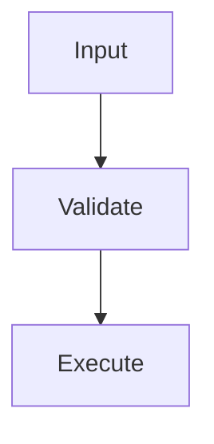

# Authoring Templates

## Principles alignment

- Cumulative: present goal, prerequisites, then actions.
- Exemplary: provide runnable examples.
- Complete: include all required sections for selected page type.
- ARID: repeat critical behavior where users need it, without duplicating canonical specs across pages.

See [principles.md](./principles.md) for the full principle taxonomy.

## Template acceptance checks

1. The page follows one template completely, not partially.
2. Metadata is present and specific to the page outcome.
3. Example blocks are runnable and use realistic values.
4. Related links point to canonical reference pages.

## Command page template

```md
---
title: <command-name> command
description: <short command purpose and outcome>
keywords: [<keyword-1>, <keyword-2>, <keyword-3>]
image: /img/docs/<command-name>-social.png
---

# <command-name>

## What this command does

<1 to 2 sentences>

## Usage

```bash
tool <command-name> [options]
```

## Arguments and options

| Flag / Argument | Shorthand | Required | Type | Default | Allowed Values | Description |
|---|---|---|---|---|---|---|
| ... | ... | ... | ... | ... | ... | ... |

## Examples

```bash
tool <command-name> ...
```

## Output and exit codes

| Exit Code | Meaning |
|---|---|
| `0` | Success |

## Related commands

- <command-a>
- <command-b>
```

## API page template

```md
---
title: <endpoint-name>
description: <short endpoint purpose and consumer context>
keywords: [<keyword-1>, <keyword-2>, <keyword-3>]
image: /img/docs/<endpoint-name>-social.png
---

# <endpoint-name>

## Summary

| Method | Path | Purpose |
|---|---|---|
| `GET` | `/v1/...` | ... |

## Authentication

<auth requirements>

## Request schema

| Field | Type | Required | Default | Allowed Values | Description |
|---|---|---|---|---|---|
| ... | ... | ... | ... | ... | ... |

## Response schema

| Field | Type | Description |
|---|---|---|
| ... | ... | ... |

## Errors

| Status | Code | Meaning | Recovery |
|---|---|---|---|
| ... | ... | ... | ... |

## Examples

```http
GET /v1/...
```
```

## Guide page template

```md
---
title: <workflow-title>
description: <short workflow outcome>
keywords: [<keyword-1>, <keyword-2>, <keyword-3>]
image: /img/docs/<workflow-slug>-social.png
---

# <workflow-title>

## Goal

<what the reader will achieve>

## Before you start

- <prereq>

## Steps

1. <step>
2. <step>

## Verify success

<expected output/state>

## Next steps

- <follow-up guide>
```

## Troubleshooting page template

```md
---
title: Troubleshooting <topic>
description: <common failure modes and recovery paths>
keywords: [<keyword-1>, <keyword-2>, <keyword-3>]
---

# Troubleshooting <topic>

## Symptom

<what fails>

## Likely causes

1. <cause>
2. <cause>

## Resolution

1. <fix>
2. <fix>

## Prevention

<guardrail>
```

## For Agents page template

```md
---
title: For Agents: <topic>
description: <agent-operable constraints and decision logic>
keywords: [<keyword-1>, <keyword-2>, <keyword-3>]
---

# For Agents: <topic>

## Scope

<what this page helps an agent do>

## Canonical sources

- <link to command reference>
- <link to API reference>

## Constraints

- <invariant>
- <invariant>

## Decision flow



## Failure handling

<fallback and retry guidance>
```

## README template

```md
# <project-name>

<one-sentence value proposition>

[🇺🇸 English](./README.md) | [🇨🇳 简体中文](./README.zh-CN.md)

<badges>

## What this solves

<problem and target users>

## Quick start

```bash
<install and first run>
```

## Requirements

- <runtime>
- <platform>

## How it works

<high-level model>

## Security

<security posture summary and reporting link>

## Documentation and support

- Docs: <link>
- Issues: <link>
- Community: <link>

## Contributing

<short pointer to CONTRIBUTING.md>

## License

<license link>
```

## Metadata authoring rule

For each template above:

1. Pull candidate terms from root `package.json` `keywords`.
2. Use those terms naturally in `description`, `keywords`, and section headings.
3. Do not force every keyword into every page.

## README i18n file layout template

For multilingual repos using en + zh-CN:

```text
README.md               ← default (English)
README.zh-CN.md
```

## Docusaurus config template (standard profile)

```js
/** @type {import('@docusaurus/types').Config} */
const config = {
  title: 'Project Docs',
  tagline: 'Short product tagline.',
  url: process.env.DOCS_LOCAL === 'true' ? 'http://localhost' : (process.env.DOCS_URL || 'https://docs.telepat.io'),
  baseUrl: process.env.DOCS_LOCAL === 'true' ? '/' : (process.env.DOCS_BASE_URL || '/project/'),
  i18n: {
    defaultLocale: 'en',
    locales: ['en', 'zh-CN']
  },
  trailingSlash: false,
  onBrokenLinks: 'throw',
  markdown: {
    hooks: {
      onBrokenMarkdownLinks: 'throw'
    }
  },
  presets: [
    [
      'classic',
      {
        docs: {
          path: '../docs',
          routeBasePath: '/',
          sidebarPath: require.resolve('./sidebars.js')
        },
        blog: false,
        theme: {
          customCss: require.resolve('./src/css/custom.css')
        }
      }
    ]
  ]
};

module.exports = config;
```

## Root scripts template

```json
{
  "scripts": {
    "typecheck": "tsc --noEmit",
    "lint": "eslint src tests --ext .ts,.tsx",
    "build": "tsc",
    "docs:start": "npm --prefix docs-site run start",
    "docs:build": "npm --prefix docs-site run build",
    "docs:serve": "npm --prefix docs-site run serve",
    "docs:deploy": "npm --prefix docs-site run deploy",
    "docs:write-translations": "npm --prefix docs-site run write-translations"
  }
}
```

## i18n layout template

```text
docs/
  ... English canonical docs

i18n/
  zh-CN/
    docusaurus-plugin-content-docs/
      current/
        ... translated docs
      current.json
    docusaurus-theme-classic/
      navbar.json
      footer.json
    code.json
```

## Quality gates CI template

```yaml
name: quality-gates
on: [pull_request]
jobs:
  checks:
    runs-on: ubuntu-latest
    steps:
      - uses: actions/checkout@v4
      - uses: actions/setup-node@v4
        with:
          node-version: 22
      - run: npm ci
      - run: npm run typecheck || npm run tscheck
      - run: npm run lint
      - run: npm run build
```
